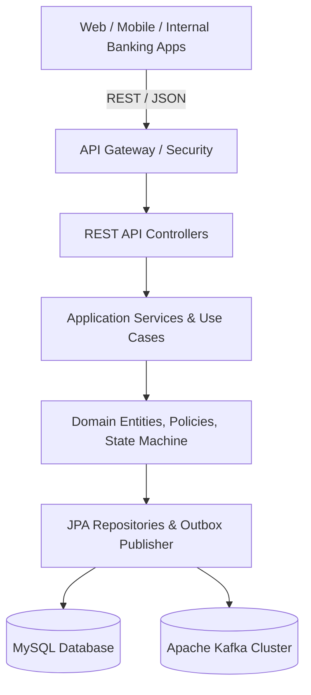

# Customer Microservice — Complete System Documentation

## 1. Executive Summary

The **Customer Microservice** serves as the core master data, identity, and lifecycle orchestrator for the Neo-Banking platform. Built with **Spring Boot 3.5.0**, **Java 21 LTS**, **Spring Data JPA**, **MySQL 8 / Flyway**, **Spring Security 6**, and **Apache Kafka**, the microservice provides high-throughput, low-latency, and audit-compliant customer management.

---

## 2. Architecture & Clean Layering

### Domain Sub-aggregates
1. **Customer Core**: UUID, Customer Number (`CUS-XXXX`), Customer Type (`INDIVIDUAL`, `CORPORATE`), Customer Status (`PROSPECT`, `ONBOARDING`, `ACTIVE`, `INACTIVE`, `CLOSED`).
2. **Contacts**: Email and Mobile channels with verification statuses (`PENDING`, `VERIFIED`) and primary flags.
3. **Addresses**: Physical addresses categorized by `PERMANENT`, `CURRENT`, and `WORK`.
4. **Preferences**: Preferred language (`ENGLISH`, `HINDI`, `MARATHI`) and communication channel toggles.
5. **Consents**: Legal compliance consents (`TERMS_AND_CONDITIONS`, `PRIVACY_POLICY`, `DATA_PROCESSING`, `MARKETING_COMMUNICATION`).
6. **Lifecycle State Machine**: Strict state transitions validated by `CustomerLifecycleTransitionPolicy`.
7. **Immutable Audit Trail**: Append-only log of every state change and identity update.
8. **Transactional Outbox & Idempotency**: Dual-write protection and duplicate event deduplication.

---

## 3. Complete REST API Reference

| Domain | Method | Path | Auth Roles | Summary |
|---|---|---|---|---|
| **Customer** | `POST` | `/api/v1/customers` | `ADMIN`, `OPERATIONS` | Create Customer Profile |
| **Customer** | `GET` | `/api/v1/customers/{id}` | `ADMIN`, `OPERATIONS`, `AUDITOR` | Get Customer By ID |
| **Customer** | `PUT` | `/api/v1/customers/{id}` | `ADMIN`, `OPERATIONS` | Update Customer Profile |
| **Lifecycle** | `POST` | `/api/v1/customers/{id}/lifecycle/actions` | `ADMIN`, `OPERATIONS` | Apply Lifecycle Transition Action |
| **Lifecycle** | `GET` | `/api/v1/customers/{id}/lifecycle/current` | `ADMIN`, `OPERATIONS`, `AUDITOR` | Get Current Lifecycle State |
| **Lifecycle** | `GET` | `/api/v1/customers/{id}/lifecycle` | `ADMIN`, `OPERATIONS`, `AUDITOR` | Get Full Lifecycle History |
| **Contacts** | `POST` | `/api/v1/customers/{id}/contacts` | `ADMIN`, `OPERATIONS` | Add Contact Channel |
| **Contacts** | `GET` | `/api/v1/customers/{id}/contacts` | `ADMIN`, `OPERATIONS`, `AUDITOR` | List Customer Contacts |
| **Contacts** | `PATCH`| `/api/v1/customers/{id}/contacts/{contactId}/primary` | `ADMIN`, `OPERATIONS` | Set Primary Contact |
| **Contacts** | `PATCH`| `/api/v1/customers/{id}/contacts/{contactId}/verify` | `ADMIN`, `OPERATIONS` | Verify Contact Channel |
| **Contacts** | `PATCH`| `/api/v1/customers/{id}/contacts/{contactId}/deactivate` | `ADMIN`, `OPERATIONS` | Deactivate Contact |
| **Addresses** | `POST` | `/api/v1/customers/{id}/addresses` | `ADMIN`, `OPERATIONS` | Add Physical Address |
| **Addresses** | `GET` | `/api/v1/customers/{id}/addresses` | `ADMIN`, `OPERATIONS`, `AUDITOR` | List Customer Addresses |
| **Addresses** | `GET` | `/api/v1/customers/{id}/addresses/{addressId}` | `ADMIN`, `OPERATIONS`, `AUDITOR` | Get Address Details |
| **Addresses** | `PUT` | `/api/v1/customers/{id}/addresses/{addressId}` | `ADMIN`, `OPERATIONS` | Update Address |
| **Addresses** | `PATCH`| `/api/v1/customers/{id}/addresses/{addressId}/deactivate` | `ADMIN`, `OPERATIONS` | Deactivate Address |
| **Preferences**| `POST` | `/api/v1/customers/{id}/preferences` | `ADMIN`, `OPERATIONS` | Create Customer Preferences |
| **Preferences**| `GET` | `/api/v1/customers/{id}/preferences` | `ADMIN`, `OPERATIONS`, `AUDITOR` | Get Preferences |
| **Preferences**| `PATCH`| `/api/v1/customers/{id}/preferences` | `ADMIN`, `OPERATIONS` | Update Preferences |
| **Preferences**| `PATCH`| `/api/v1/customers/{id}/preferences/deactivate` | `ADMIN`, `OPERATIONS` | Deactivate Preferences |
| **Consents** | `POST` | `/api/v1/customers/{id}/consents` | `ADMIN`, `OPERATIONS` | Grant Regulatory Consent |
| **Consents** | `PATCH`| `/api/v1/customers/{id}/consents/withdraw` | `ADMIN`, `OPERATIONS` | Withdraw Consent |
| **Consents** | `GET` | `/api/v1/customers/{id}/consents` | `ADMIN`, `OPERATIONS`, `AUDITOR` | Get All Consents History |
| **Consents** | `GET` | `/api/v1/customers/{id}/consents/{type}` | `ADMIN`, `OPERATIONS`, `AUDITOR` | Get Consents by Type |
| **Consents** | `GET` | `/api/v1/customers/{id}/consents/{type}/latest` | `ADMIN`, `OPERATIONS`, `AUDITOR` | Get Latest Consent by Type |
| **Audit** | `GET` | `/api/v1/customers/{id}/audit` | `ADMIN`, `AUDITOR` | Get Customer Audit Trail |

---

## 4. Database Schema & Tables

All tables use `CHAR(36)` foreign keys pointing to `customers(id)` with strict referential integrity, indexes on state and timestamp columns, and explicit unique constraints:
- `customers`
- `customer_contacts`
- `customer_addresses`
- `customer_preferences`
- `customer_consents`
- `customer_lifecycle`
- `audit_events`
- `event_outbox`
- `processed_event`

---

## 5. Event Publishing & Kafka Contracts

- **Topic**: `customer.lifecycle.changed`
- **Pattern**: Transactional Outbox (Atomically written during state transitions; published asynchronously via scheduled background worker).
- **Consumer**: Idempotent message processor with unique event ID constraint deduplication.
