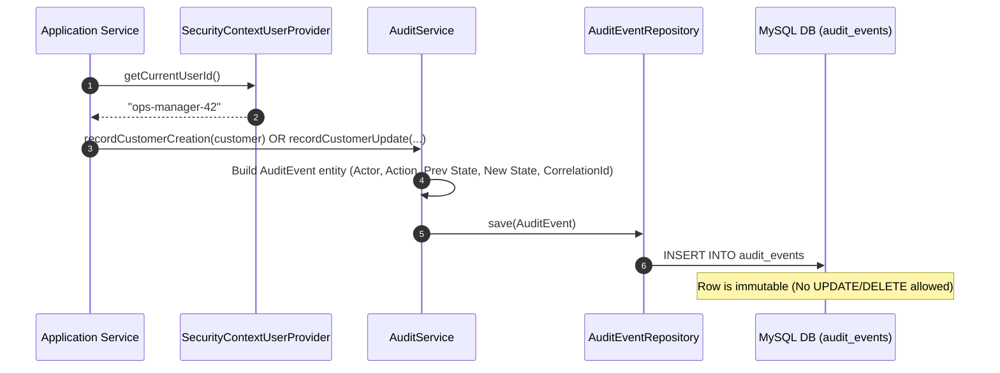

# Immutable Audit Logging & Compliance Flow

## Regulatory Compliance & Audit Design

To adhere to global financial regulations (e.g., Basel III, GDPR, SOC 2, PCI-DSS), the Customer Microservice provides an immutable audit trail capturing every state change, identity mutation, and lifecycle transition.

---

## Audit Actions Reference

| Audit Action | Trigger Source | Payload Details Recorded |
|---|---|---|
| `CUSTOMER_CREATED` | `CustomerService.createCustomer` | Customer ID, Initial Status `PROSPECT`, Creator User ID |
| `CUSTOMER_UPDATED` | `CustomerService.updateCustomer` | Previous names/nationality $\rightarrow$ New names/nationality |
| `CUSTOMER_LIFECYCLE_CHANGED` | `CustomerLifecycleService.applyAction` | Previous Status $\rightarrow$ New Status, Reason code |
| `CUSTOMER_CONTACT_ADDED` | `CustomerContactService.addContact` | Contact type, masked value, primary status |
| `CUSTOMER_CONTACT_UPDATED` | `CustomerContactService.verifyContact` | Verification state change $\rightarrow$ `VERIFIED` |
| `CUSTOMER_ADDRESS_ADDED` | `CustomerAddressService.addAddress` | Address type, street line 1, city, state, country |
| `CUSTOMER_PREFERENCE_UPDATED`| `CustomerPreferenceService.updatePreference` | Preferred language, communication channels |
| `CUSTOMER_CONSENT_GRANTED` | `CustomerConsentService.grantConsent` | Consent type, version code, capture source |
| `CUSTOMER_CONSENT_WITHDRAWN`| `CustomerConsentService.withdrawConsent` | Consent type, withdrawal timestamp |

---

## PII Masking Architecture

In accordance with privacy standards, sensitive PII data is sanitized before entering operational log files using `com.neobank.neobank_backend.common.util.MaskingUtil`:

- **Email Masking**: `john.doe@company.com` $\rightarrow$ `j***e@company.com`
- **Phone Masking**: `+15551234567` $\rightarrow$ `*******4567`
- **Names Masking**: `Alexander` $\rightarrow$ `A*******r`
- **Generic Masking**: `1234567890123456` $\rightarrow$ `************3456`
