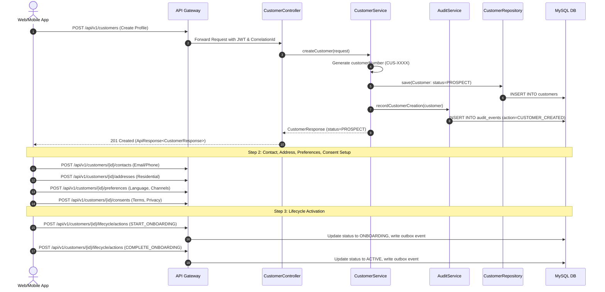

# Customer Journey & Onboarding Flow

## Customer End-to-End Onboarding Sequence

---

## Detailed Step-by-Step Breakdown

1. **Prospect Creation**:
   - Customer profile is initialized with first name, last name, date of birth, nationality, and customer type.
   - Initial state is set to `PROSPECT`.
   - Initial `CUSTOMER_CREATED` audit event and `PROSPECT` lifecycle milestone are committed in the same database transaction.
2. **Contact & Verification Setup**:
   - Multiple contact channels (Primary Email, Mobile Phone) are registered.
   - Verification flows (e.g., OTP or email verification) trigger status changes from `PENDING` $\rightarrow$ `VERIFIED`.
3. **Address Registration**:
   - Primary `PERMANENT` or `CURRENT` physical address is saved with country, state, postal code, and lines.
4. **Preferences & Consents**:
   - User language preference (English, Hindi, Marathi) and notifications (Email, SMS, Push) are recorded.
   - Legal consents (Terms and Conditions, Data Processing, Privacy Policy) are recorded with explicit versions and timestamps.
5. **Lifecycle Progression**:
   - Operational/KYC checks initiate `START_ONBOARDING` transitioning the customer to `ONBOARDING`.
   - Once all identity requirements are met, `COMPLETE_ONBOARDING` transitions the customer to `ACTIVE`.
