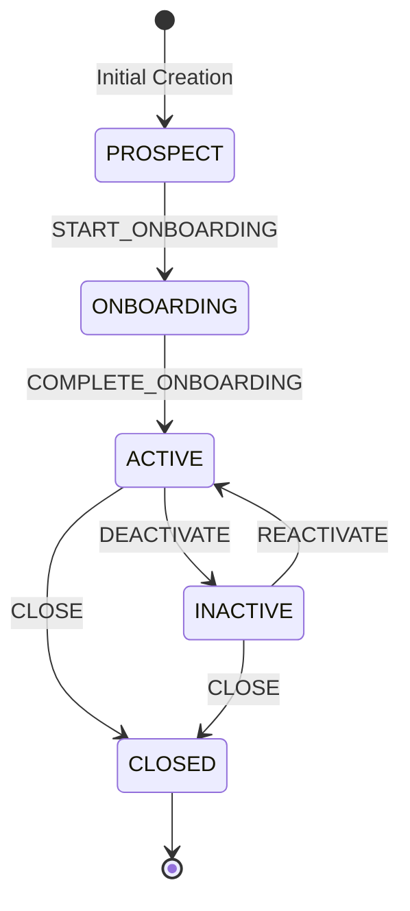

# Customer Lifecycle State Machine Flow

## State Machine Diagram

The Customer Microservice enforces strict, state-machine transitions through the `CustomerLifecycleTransitionPolicy` domain policy.

---

## State Transition Matrix

| Current State | Permitted Action | Next State | Reason Recorded | Event Published |
|---|---|---|---|---|
| **PROSPECT** | `START_ONBOARDING` | **ONBOARDING** | `ONBOARDING_STARTED` | Yes (`customer.lifecycle.changed`) |
| **ONBOARDING** | `COMPLETE_ONBOARDING` | **ACTIVE** | `ONBOARDING_COMPLETED` | Yes (`customer.lifecycle.changed`) |
| **ACTIVE** | `DEACTIVATE` | **INACTIVE** | `CUSTOMER_DEACTIVATED` | Yes (`customer.lifecycle.changed`) |
| **INACTIVE** | `REACTIVATE` | **ACTIVE** | `CUSTOMER_REACTIVATED` | Yes (`customer.lifecycle.changed`) |
| **ACTIVE** | `CLOSE` | **CLOSED** | `CUSTOMER_CLOSED` | Yes (`customer.lifecycle.changed`) |
| **INACTIVE** | `CLOSE` | **CLOSED** | `CUSTOMER_CLOSED` | Yes (`customer.lifecycle.changed`) |
| **CLOSED** | *(Any Action)* | — | **TERMINAL STATE (Forbidden)** | — |

---

## Transactional State Change Invariants

1. **Atomic Dual-Update**:
   - `customers.customer_status` column is updated to reflect the new state.
   - A new row is appended to `customer_lifecycle` containing previous status, current status, reason, effective timestamp, and actor details.
2. **Audit Event Generation**:
   - A row is written to `audit_events` with `action = CUSTOMER_LIFECYCLE_CHANGED`.
3. **Outbox Message Insertion**:
   - A JSON payload is saved to `event_outbox` with `status = PENDING`.
4. **Rollback Guarantee**:
   - If any step fails during the operation, `@Transactional` ensures all mutations roll back cleanly. No partial updates, orphan audit logs, or orphaned outbox messages remain.
