# Database Architecture & Schema Documentation

## Entity Relationship Diagram (ERD)

```mermaid
erDiagram
    CUSTOMERS ||--o{ CUSTOMER_CONTACTS : "has"
    CUSTOMERS ||--o{ CUSTOMER_ADDRESSES : "has"
    CUSTOMERS ||--o| CUSTOMER_PREFERENCES : "has"
    CUSTOMERS ||--o{ CUSTOMER_CONSENTS : "has"
    CUSTOMERS ||--o{ CUSTOMER_LIFECYCLE : "history"
    CUSTOMERS ||--o{ AUDIT_EVENTS : "audited"

    CUSTOMERS {
        CHAR(36) id PK
        VARCHAR(32) customer_number UK
        VARCHAR(32) customer_type
        VARCHAR(32) customer_status
        VARCHAR(100) first_name
        VARCHAR(100) middle_name
        VARCHAR(100) last_name
        DATE date_of_birth
        VARCHAR(3) nationality
        BIGINT version
        TIMESTAMP created_at
        VARCHAR(100) created_by
        TIMESTAMP updated_at
        VARCHAR(100) updated_by
    }

    CUSTOMER_CONTACTS {
        BIGINT id PK
        CHAR(36) customer_id FK
        VARCHAR(32) contact_type
        VARCHAR(255) contact_value
        BOOLEAN is_primary
        VARCHAR(32) verification_status
        VARCHAR(32) status
        TIMESTAMP created_at
    }

    CUSTOMER_ADDRESSES {
        BIGINT id PK
        CHAR(36) customer_id FK
        VARCHAR(32) address_type
        VARCHAR(255) address_line1
        VARCHAR(255) address_line2
        VARCHAR(100) city
        VARCHAR(100) state
        VARCHAR(3) country
        VARCHAR(20) postal_code
        VARCHAR(32) status
    }

    CUSTOMER_PREFERENCES {
        BIGINT id PK
        CHAR(36) customer_id FK,UK
        VARCHAR(10) preferred_language
        VARCHAR(32) preferred_channel
        BOOLEAN marketing_notifications
        BOOLEAN transaction_notifications
        BOOLEAN security_notifications
        VARCHAR(32) status
    }

    CUSTOMER_CONSENTS {
        BIGINT id PK
        CHAR(36) customer_id FK
        VARCHAR(64) consent_type
        VARCHAR(32) status
        VARCHAR(32) consent_version
        VARCHAR(64) consent_text_version
        VARCHAR(32) source
        TIMESTAMP granted_at
        TIMESTAMP withdrawn_at
    }

    CUSTOMER_LIFECYCLE {
        BIGINT id PK
        CHAR(36) customer_id FK
        VARCHAR(32) previous_status
        VARCHAR(32) current_status
        VARCHAR(64) reason
        TIMESTAMP effective_at
    }

    AUDIT_EVENTS {
        BIGINT id PK
        CHAR(36) customer_id
        VARCHAR(64) action
        VARCHAR(255) previous_state
        VARCHAR(255) new_state
        VARCHAR(500) description
        VARCHAR(100) actor_id
        VARCHAR(32) actor_type
        VARCHAR(64) correlation_id
        TIMESTAMP timestamp
        VARCHAR(100) source_service
    }

    EVENT_OUTBOX {
        BIGINT id PK
        VARCHAR(64) aggregate_type
        VARCHAR(64) aggregate_id
        VARCHAR(128) event_type
        LONGTEXT payload
        VARCHAR(32) status
        INT retry_count
        TIMESTAMP created_at
        TIMESTAMP published_at
    }

    PROCESSED_EVENT {
        BIGINT id PK
        VARCHAR(128) event_id UK
        VARCHAR(128) event_type
        TIMESTAMP processed_at
    }
```

---

## Flyway Migration Log

| Script | Description | Applied Objects |
|---|---|---|
| `V1__create_customers_table.sql` | Master Customer Table | Table `customers`, UK `uk_customers_customer_number`, Indexes `idx_customers_status`, `idx_customers_name` |
| `V2__create_customer_contacts_table.sql` | Contact Vectors | Table `customer_contacts`, FK to `customers(id)`, UK `uk_customer_contact_type_value` |
| `V3__create_customer_addresses_table.sql` | Physical Addresses | Table `customer_addresses`, FK to `customers(id)`, UK `uk_customer_address_type` |
| `V4__create_customer_preferences_table.sql`| Communication Preferences| Table `customer_preferences`, FK & UK on `customer_id` |
| `V5__create_customer_consents_table.sql` | Regulatory Consents | Table `customer_consents`, FK to `customers(id)`, Indexes on `(customer_id, consent_type)` |
| `V6__create_customer_lifecycle_table.sql` | Lifecycle Transition Log | Table `customer_lifecycle`, FK to `customers(id)`, Indexes on `(customer_id, effective_at)` |
| `V7__create_audit_outbox_processed_tables.sql`| Audit, Outbox & Idempotency | Tables `audit_events`, `event_outbox`, `processed_event`, Indexes & Unique constraints |
