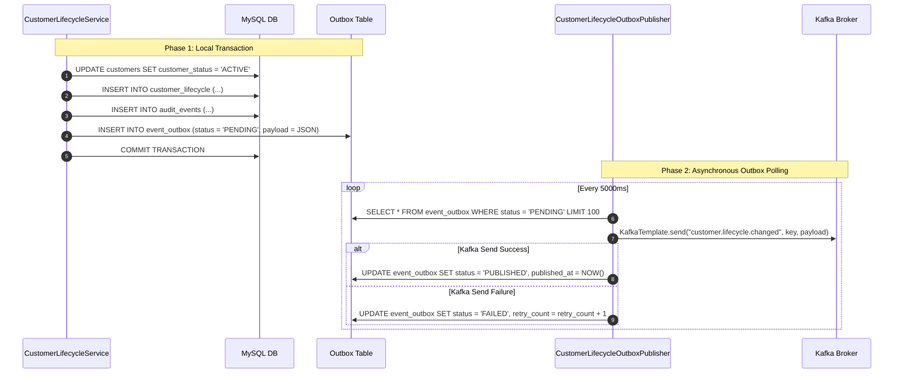

# Transactional Outbox Pattern Architecture

## Problem Statement

In distributed systems, publishing an event directly to a message broker (Kafka) inside a database transaction risks the Dual-Write Problem:
1. Database commits, but network failure prevents Kafka publish $\rightarrow$ Event is lost.
2. Kafka publish succeeds, but database transaction rolls back $\rightarrow$ Phantom event is published.

---

## Solution: Transactional Outbox Pattern

---

## Key Resilience Features

- **No Distributed Transactions (2PC)**: Keeps the operational database fast and independent of broker availability.
- **Ordered Polling**: `findTop100ByStatusOrderByCreatedAtAsc` preserves message order per partition key.
- **Fail-Safe Retries**: Transient Kafka outages simply leave records in `PENDING`/`FAILED` state until connectivity resumes.
